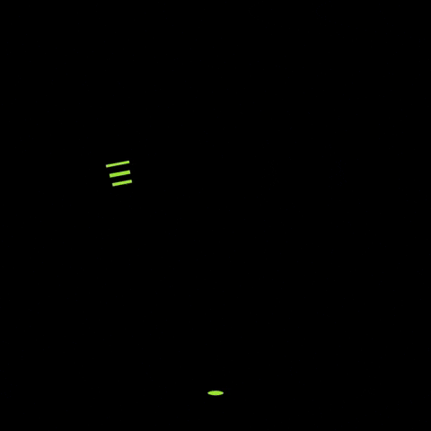

# 👾 Olá, É bom ter você por aqui! 🤓

Sou desenvolvedor de jogos, estudante da EEEP Edson Queiroz, cursando o terceiro ano de informática

- 💻  Estudante de informática
- 🎮 Fã de jogos indie
- 👩‍💻 Aprendendo algo sobre Godot

  
  
  
  
  
  

---

