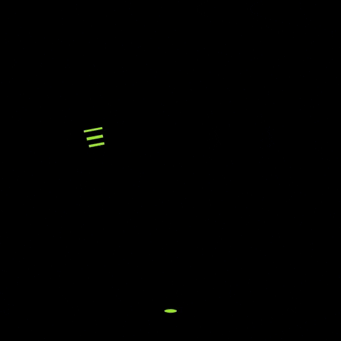
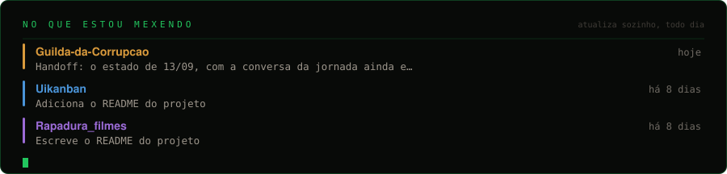
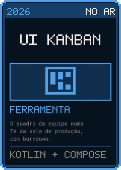

  

  
  

### Sobre

- 💻 Ciência da Computação
- 🎮 Movido a base de Hollow Knight
- 👩‍💻 Aprendendo algo sobre react

  
  

### Tecnologias

  
  
  
  

  
  
  
  
  

  
  
  
  
  
  

### No que estou mexendo

### Estatísticas

  
  
  

### A mão de hoje

<!-- BARALHO:INICIO -->

  
  
  

<!-- BARALHO:FIM -->

o baralho tem mais cartas — três são sorteadas por dia

### Contribuições

<picture>
  <source media="(prefers-color-scheme: dark)" srcset="https://raw.githubusercontent.com/Israel-Mendes-git/Israel-Mendes-git/output/pacman-contribution-graph-dark.svg">
  <source media="(prefers-color-scheme: light)" srcset="https://raw.githubusercontent.com/Israel-Mendes-git/Israel-Mendes-git/output/pacman-contribution-graph.svg">
  
</picture>

<!--
   Você abriu o código-fonte do README. Respeito.
                 ___
                /   \      "A guilda vai cair mais cedo ou mais tarde.
               | o o |       A questão é quão longe você chega antes."
               |  ^  |
                \___/       — Guilda da Corrupção, em obra
               /|   |              / |___| \      github.com/Israel-Mendes-git/Guilda-da-Corrupcao
-->
