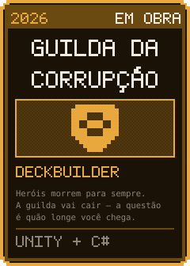

  

  

### Sobre

- 🎮 Faço jogo desde 2024 — roguelike e sistema de cartas, quase sempre sozinho
- 🏢 Desenvolvedor na [Rapadura Atômica](https://rapaduraatomica.com.br), estúdio de animação e jogos
- 💻 Cursando Ciência da Computação
- 🕹️ Movido a base de Hollow Knight

### Contato

  
  

 

### Ficha

### O baralho

  
  
  

### 🔨 No que estou mexendo

<!-- DEVLOG:INICIO -->
> **[Uikanban](https://github.com/Israel-Mendes-git/Uikanban)** · há 4 dias  
> Adiciona o README do projeto
>
> **[Rapadura_filmes](https://github.com/Israel-Mendes-git/Rapadura_filmes)** · há 4 dias  
> Escreve o README do projeto
>
> **[tower-defense](https://github.com/Israel-Mendes-git/tower-defense)** · há 4 dias  
> Ajusta a abertura do PLANO
<!-- DEVLOG:FIM -->

### Tecnologias

  
  
  
  
  
  
  
  

  
  
  
  
  
  
  

---

---

<picture>
    <source media="(prefers-color-scheme: dark)" srcset="https://raw.githubusercontent.com/Israel-Mendes-git/Israel-Mendes-git/output/pacman-contribution-graph-dark.svg">
    <source media="(prefers-color-scheme: light)" srcset="https://raw.githubusercontent.com/Israel-Mendes-git/Israel-Mendes-git/output/pacman-contribution-graph.svg">
    
</picture>

<!--
   Você abriu o código-fonte do README. Respeito.
                 ___
                /   \      "A guilda vai cair mais cedo ou mais tarde.
               | o o |       A questão é quão longe você chega antes."
               |  ^  |
                \___/       — Guilda da Corrupção, em obra
               /|   |              / |___| \      github.com/Israel-Mendes-git/Guilda-da-Corrupcao
-->
