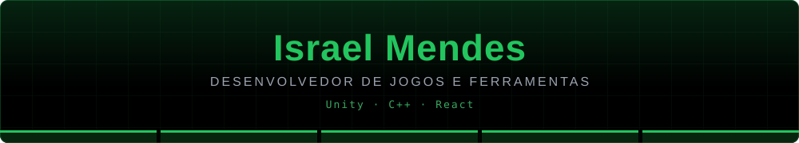

Desenvolvedor na [Rapadura Atômica](https://rapaduraatomica.com.br), em Cascavel/CE: **C++** no
software de animação do estúdio, **web em produção** e **ferramentas de pipeline**.
Fora do expediente faço jogo — roguelike e sistema de cartas.

**[Portfólio](https://israel-mendes-git.github.io)** · **[E-mail](mailto:israelmendesmzs@gmail.com)**

### No ar, com gente usando

- **[Nuclear](https://github.com/Rapadura-Atomica/Nuclear)** · C++ — fork do Blender que anima as séries do estúdio. Sou o segundo dev, com 203 commits.
- **[Filmerama](https://github.com/Israel-Mendes-git/Rapadura_filmes)** · React — plataforma de streaming do estúdio, em [filmerama.com](https://filmerama.com).
- **[UI Kanban](https://github.com/Israel-Mendes-git/Uikanban)** · Kotlin — o quadro da equipe numa TV da sala de produção.

### Jogos

- **[Guilda da Corrupção](https://github.com/Israel-Mendes-git/Guilda-da-Corrupcao)** · Unity — roguelike de guilda com combate por cartas, com simulador de balanceamento.
- **[O Grito da Mata](https://github.com/Israel-Mendes-git/Roguelike)** · Unity — roguelike com mapas procedurais por grafos e permadeath.

Em obra: **[Dizido](https://github.com/Israel-Mendes-git/Dizido)** · .NET — chat onde a decisão sobrevive à conversa.

### Stack

**Jogos** Unity · C# · Godot · GDScript
**Sistemas** C++ · Python · bpy · Linux · Docker
**Web e apps** React · Next.js · TypeScript · Django · .NET · Kotlin

<b>English</b>

 

Developer at [Rapadura Atômica](https://rapaduraatomica.com.br), in Cascavel, Brazil: **C++** in the
studio's animation software, **web apps in production**, and **pipeline tooling**.
After hours I make games — roguelikes and card systems.

**In production**

- **[Nuclear](https://github.com/Rapadura-Atomica/Nuclear)** · C++ — a Blender fork that animates the studio's series. I am the second dev, with 203 commits.
- **[Filmerama](https://github.com/Israel-Mendes-git/Rapadura_filmes)** · React — the studio's streaming platform, at [filmerama.com](https://filmerama.com).
- **[UI Kanban](https://github.com/Israel-Mendes-git/Uikanban)** · Kotlin — the team board on a production-room TV.

**Games**

- **[Guilda da Corrupção](https://github.com/Israel-Mendes-git/Guilda-da-Corrupcao)** · Unity — guild roguelike with card combat and a balance simulator.
- **[O Grito da Mata](https://github.com/Israel-Mendes-git/Roguelike)** · Unity — roguelike with graph-based procedural maps and permadeath.

In progress: **[Dizido](https://github.com/Israel-Mendes-git/Dizido)** · .NET — team chat where the decision outlives the conversation.

**[Portfolio](https://israel-mendes-git.github.io)** · **[Email](mailto:israelmendesmzs@gmail.com)**

<picture>
  <source media="(prefers-color-scheme: dark)" srcset="https://raw.githubusercontent.com/Israel-Mendes-git/Israel-Mendes-git/output/pacman-contribution-graph-dark.svg">
  <source media="(prefers-color-scheme: light)" srcset="https://raw.githubusercontent.com/Israel-Mendes-git/Israel-Mendes-git/output/pacman-contribution-graph.svg">
  
</picture>
